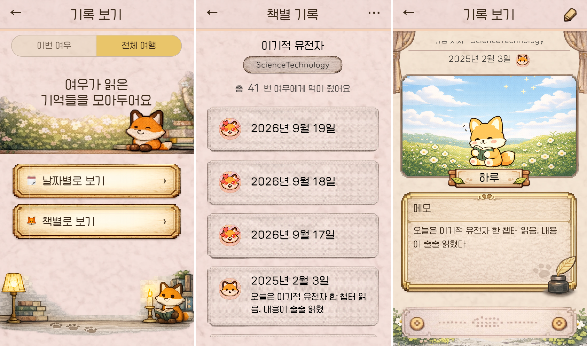

# 여우비

> 책을 기록하면 여우가 성장합니다 

여우비는 독서 기록에 따라 캐릭터가 성장하는 **다마고치 형태의 감성적 독서 관리 모바일 웹 서비스**입니다.

완독이나 많은 독서량에 집중하기보다, 책을 읽으며 떠오른 생각과 인상 깊었던 문장을 부담 없이 기록하고 꾸준히 이어가는 경험에 집중했습니다.

## 바로 사용해보기

* **[여우비 서비스](https://book-fox.vercel.app)** — 실제 서비스 버전
* **[개발자 버전](https://book-fox-dev.vercel.app)** — 테스트를 위해 날짜를 직접 다음 날로 이동할 수 있는 버전

##  기술 스택

* React, TypeScript, TanStack Query, Zustand, Tailwind CSS

##  주요 기능

* **개발자 버전** — 메인 화면의 Dev Mode 버튼을 통해 날짜를 직접 변경하여 다음 날의 기록과 캐릭터 성장을 테스트할 수 있습니다.
* **배포 버전** — 실제 사용 환경에 맞춰 현재 날짜를 기준으로 독서 기록을 작성하고 캐릭터를 성장시킬 수 있습니다.

* **캐릭터 성장** - 책을 기록할 때마다 캐릭터에게 먹이를 주며, 독서 기록의 개수와 종류에 따라 캐릭터가 다양한 직업으로 성장합니다.

* **독서 기록** — 메인 화면의 먹이주기를 통해 읽은 책을 기록하고, 기록한 책은 독서 기록 화면에서 다시 확인할 수 있습니다.

* **캐릭터 도감** — 성장 과정에서 해금된 다양한 직업과 성장을 완료한 캐릭터를 도감에서 확인할 수 있습니다.